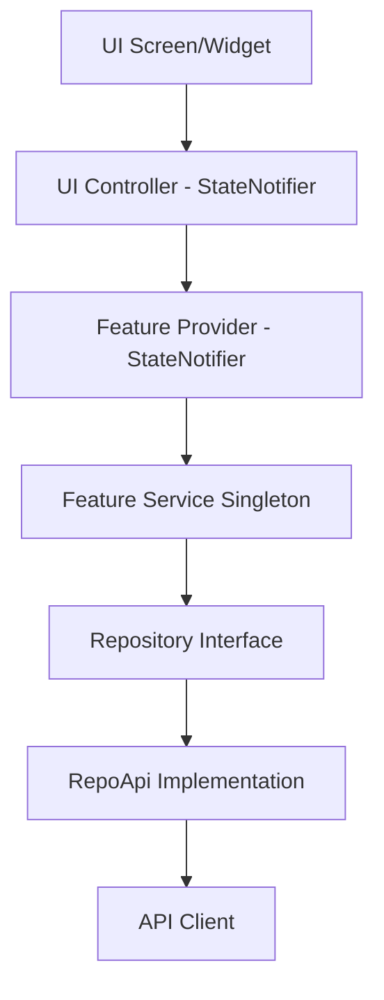

# Kiến trúc hệ thống (Architecture)

Project được thiết kế dựa trên kiến trúc phân lớp, tuân thủ nguyên tắc Dependency một chiều (Unidirectional Dependency Flow) kết hợp với **Riverpod** cho State Management.

Dựa trên code thực tế, Data Flow của ứng dụng là:

## Giải thích các Layer

1. **UI (Presentation):** Nơi chứa các Widget, Screen hiển thị cho người dùng.
2. **UI Controller (`home_controller.dart`, v.v):** Là các `StateNotifier` quản lý trạng thái riêng của UI (loading, form error), đồng thời lắng nghe (listen) dữ liệu từ Feature Provider.
3. **Feature Provider (`report_providers.dart`, v.v):** Là các `StateNotifier` chứa state dữ liệu chính của Domain/Feature (như danh sách báo cáo, thông báo).
4. **Service:** Là class đóng vai trò điều phối (orchestration) gọi đến Repository.
5. **Repository:** Xử lý việc gọi API thực tế hoặc Mock.
6. **API Client:** Lớp thấp nhất thực hiện HTTP request.

## Các quy tắc bắt buộc

- KHÔNG để Repository hoặc Service chứa logic thay đổi UI.
- KHÔNG để Controller gọi trực tiếp Repository bỏ qua Provider/Service.
- Dependency chỉ được truyền từ trên xuống dưới (hoặc UI lắng nghe Provider).
- Mọi logic xử lý state phức tạp nên nằm ở Provider, còn UI Controller chỉ đóng vai trò mediator để hiển thị.
