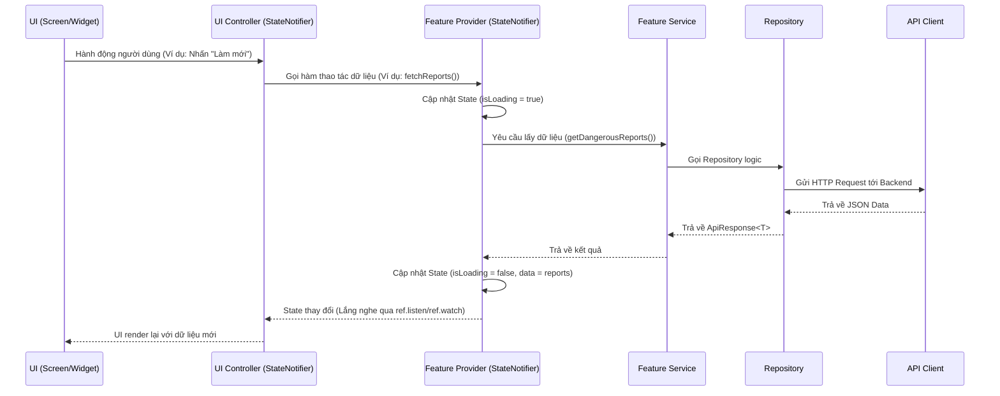

# Data Flow & State Management

Ứng dụng `smartspace_client` sử dụng **Riverpod** làm giải pháp quản lý trạng thái. Data Flow tuân thủ luồng một chiều (Unidirectional Data Flow).

## Sơ đồ luồng dữ liệu

## Giải thích luồng
1. **User Action:** Bắt đầu từ UI khi người dùng tương tác.
2. **Controller/Provider:** Các action không liên quan logic chia sẻ (vd: mở/đóng tab) được xử lý tại UI Controller. Các action lấy/sửa dữ liệu được truyền tới Feature Provider.
3. **Fetching Data:** Provider không gọi API trực tiếp. Nó nhờ Service.
4. **Service & Repository:** Service có thể kết hợp nhiều Repository hoặc thêm bước log, sau đó Repository thực thi API call.
5. **State Update:** Khi có dữ liệu, Provider emit state mới. UI đang `ref.watch(provider)` sẽ tự động rebuild.
