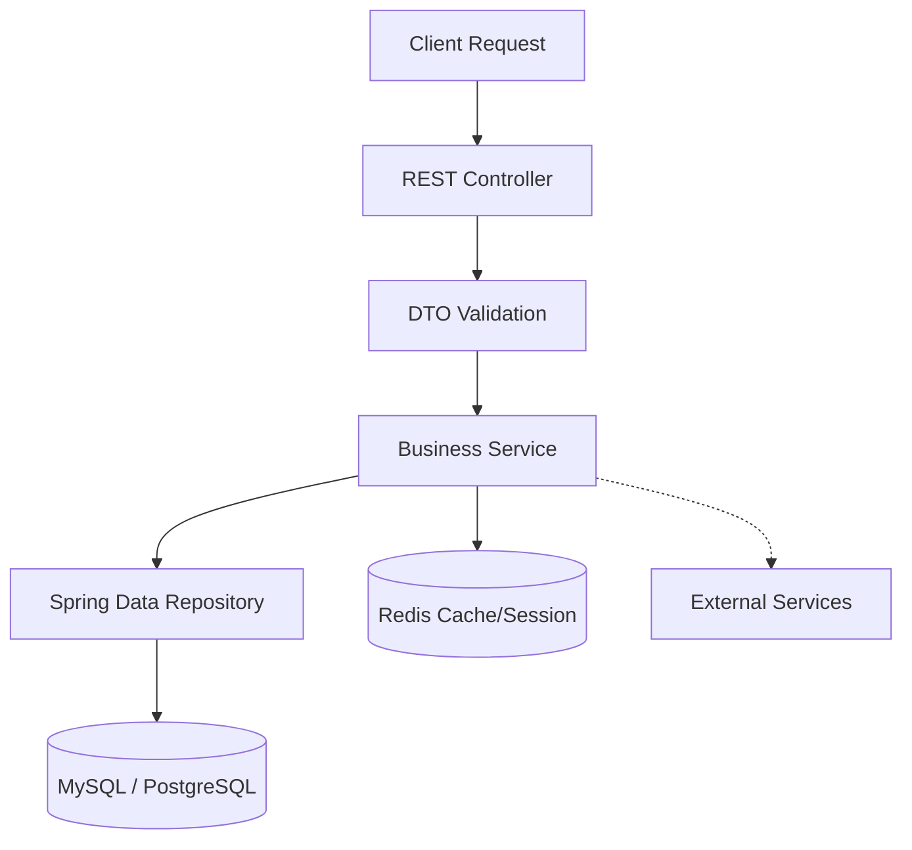

# Backend Architecture (`SmartSpace_Backend`)

Backend của hệ thống được viết bằng Spring Boot, thiết kế theo mô hình N-Tier (N-lớp) tập trung vào tính phân tách rõ ràng trách nhiệm.

## Các luồng hoạt động chính (API Flow)
Dựa trên kiến trúc thực tế, luồng hoạt động chuẩn của mọi API như sau:

## Nguồn chân lý (Source of Truth)
- API tham chiếu: `AuthController.java` & `AuthenticationService.java`
- Tài liệu này đóng vai trò chuẩn mực để khởi tạo hoặc sửa chữa API sau này, đảm bảo không có logic trùng lặp (duplicate) và không vi phạm Dependency Rule.

Đọc tiếp các quy định chi tiết tại:
- [API Rules (Controller, Service, Repo)](api_rules.md)
- [Security & Performance](security_and_performance.md)
- [Development Workflow](workflow.md)
